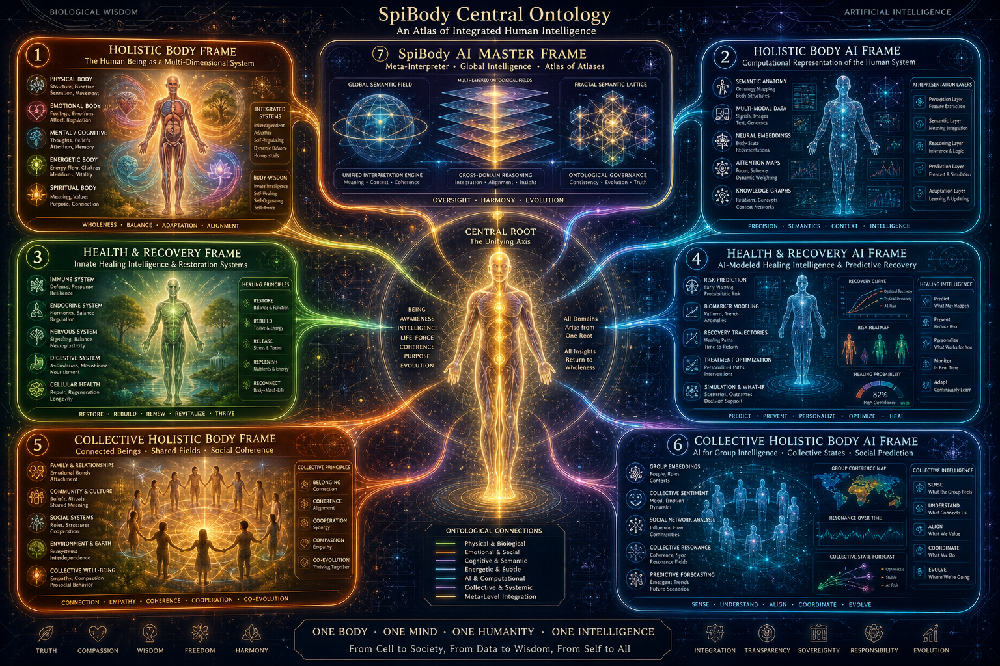
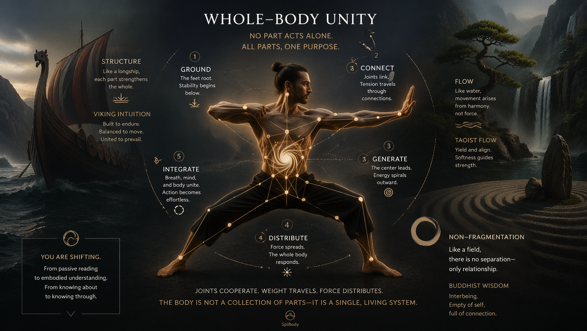
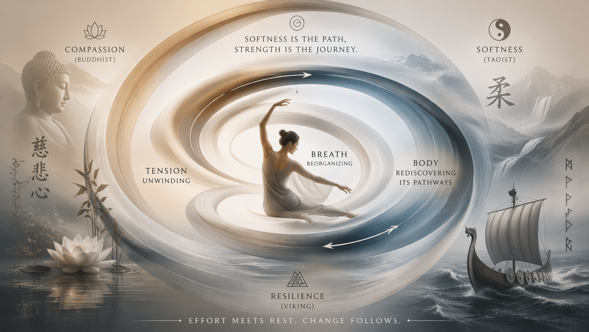
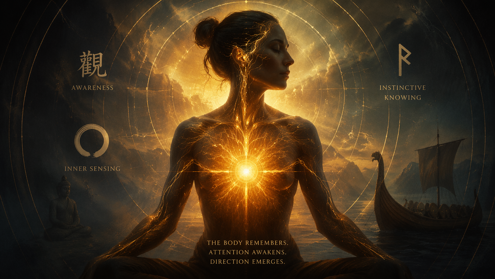
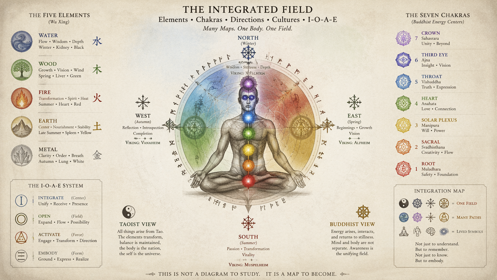
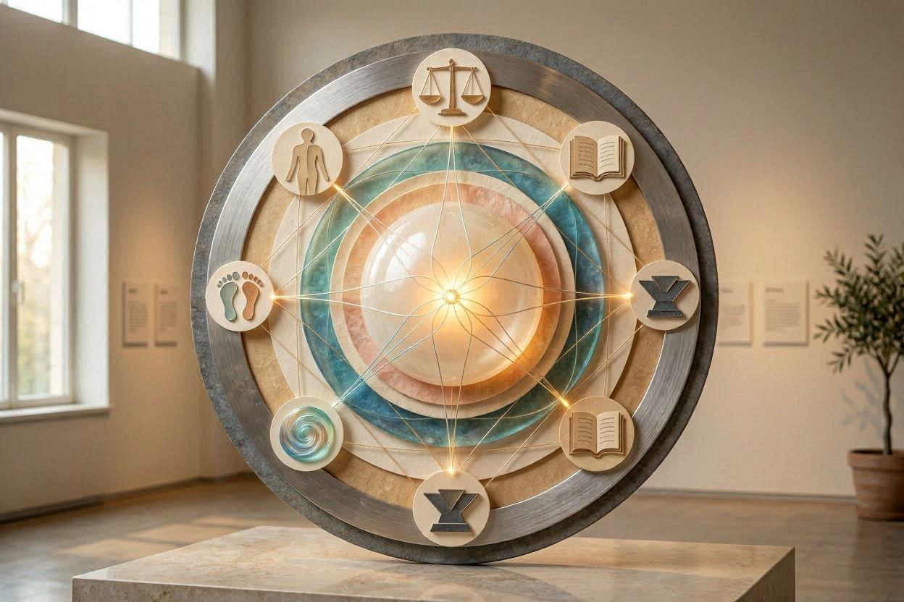
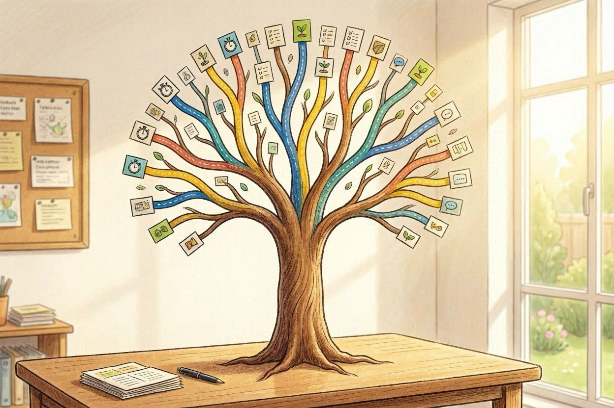
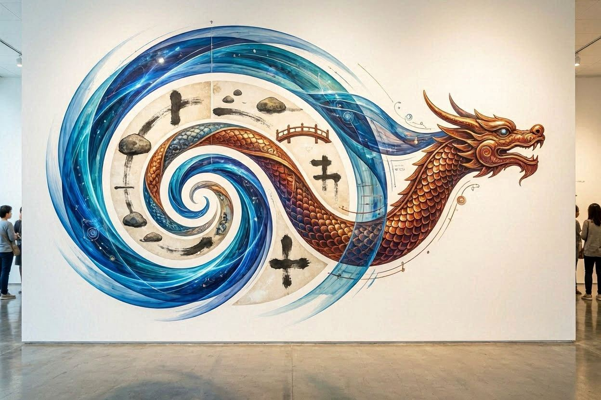
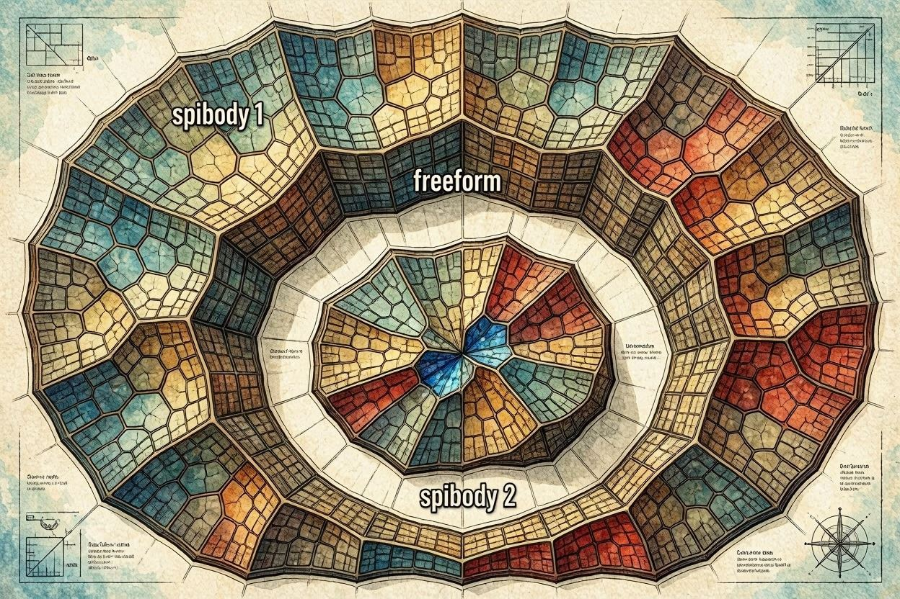

# What to read?

Nobody stops you from jumping directly to interactive version of [SpiBody](https://embeddable.live/embed/Utg4YGE0tV). This is for lazy and curious.

### Read SpiBodie's central texts to get Rooted and Spirited if you can do it yourself -

ideally, it's a free flow based on your strict intuition and practical consideration, a seed theory rather than any math concerely, altough I tried to give the basic version of this inspiration, also using mine:
- SpiBody AI: ⇒ Enter ***Y***.
  ### [🌱 SpiBody](Rooted/Central/spibodyai.md)
- SpiBody 1A: ↝ ***X***.
  ## [🦴 Rooted/Central/holisticbody.md](Rooted/Central/holisticbody.md)
- SpiBody 1B: ↝ ***Z***.
  ## [💧 Rooted/Central/healthandrecoveryai.md](Rooted/Central/healthandrecoveryai.md)

### In Zen and Tao, you use Attention and Create! It's a Creation World.

SpiBody 2 — Trivia is the later version, which was trying to achieve even more short, to grow from religion into sport (each initial text follows minimalist rules, and version 2 takes it to the end):
- [GitHub Doc](https://github.com/tambetvali/SpiZenTao#-tao-spibody-2) - Text + Images
- [YouWare App](https://eal22hc5nr.youware.app/) - Text + Images + Web App
- [StickLight App](https://5e8c1ee7-0beb-4654-ba8e-238d405b0b74-qtxqyv.sticklight.app/) - Text + Images + Web App 2

# SpiBody — Introduction

*Or jump to the [Old Introduction](https://github.com/tambetvali/SpiBody/tree/main/Rooted/Central)* or
- [SpiBody 2](https://github.com/tambetvali/SpiZenTao/tree/main#tao-spibody-2) — Trivia.

SpiBody begins in the movements you already make: the way you stand when waiting, the way you reach for something, the way your weight shifts when you turn.  
Training here grows inside everyday actions until the whole body becomes more coordinated, more responsive, and more capable.  
You don’t need to prepare or understand everything in advance — you can start anywhere, and the body will meet you halfway.  
If you want a first sense of the landscape — the tone, the direction, the feeling — these three sites give you a broad view before you step into the deeper materials.  
They show how movement becomes clarity, how strength grows from softness, and how everyday actions become training.

- [🌐 **Gamma Overview — “Report from Gamma.app”**](https://spibody-the-bodymind-som-1a9nedu.gamma.site/)  
- [🧭 **Simplified Overview — “SpiBody Path”**](https://laegna-spibody-path.lovable.app/)  
- [🕸 **Full Method Map — “Material Meditation → Somatic Awakening”**](https://soma-material-path.lovable.app/)

---

# Rooted / Central

These are the six core texts of SpiBody.

---

## Holistic Body — Text 1

> ### **Whole‑Body Coordination & Natural Strength**  
> **Default version:** [🦴 Rooted/Central/holisticbody.md](Rooted/Central/holisticbody.md)  
> → A grounded, experiential description of whole-body training: how to sense the body as one piece, how to let movement flow through multiple layers, and how to build strength through coordination rather than strain.  
> - **AI version:** [🧠 Rooted/Central/holisticbodyai.md](Rooted/Central/holisticbodyai.md)  
>   → A compact, structured restatement of the same principles, highlighting steps and patterns for quick application.

This is the heart of SpiBody: how the whole body acts as one system, how movement distributes itself, and how strength appears when effort stops fighting itself.  
You’ll find descriptions of how to stand, how to move, how to let the body reorganize itself while you act — not through force, but through clarity and connection.  
The texts show how joints cooperate, how weight travels, how tension dissolves, and how new layers of movement appear over time.  
They also describe how everyday actions — opening a door, lifting a bag, walking across a room — can become training that builds structure, precision, and ease.  
If you want to understand the method through direct physical experience, this is where to begin.

---

## Health, Recovery & Collective Body — Text 2

> ### **Recovery Through Movement & Rebalancing**  
> **Default version (AI):** [💧 Rooted/Central/healthandrecoveryai.md](Rooted/Central/healthandrecoveryai.md)  
> → A step-by-step view of recovery as a physical process: how to support healing through movement, how to reduce unnecessary tension, and how to rebuild strength with minimal strain.  
> - **Original version:** [🌱 Rooted/Central/healthandrecovery.md](Rooted/Central/healthandrecovery.md)  
>  → A more intuitive, experiential look at how health grows from everyday actions, rest, and the body’s natural ability to reorganize itself.

> ### **Shared Fields & Collective Somatic Dynamics**  
> **Default version (AI):** [🔗 Rooted/Central/collectiveholisticbodyai.md](Rooted/Central/collectiveholisticbodyai.md)  
> → A structured exploration of collective somatic fields: how group dynamics shape movement, how shared rhythms emerge, and how training can extend beyond the individual.  
> - **Original version:** [🤝 Rooted/Central/collectiveholisticbody.md](Rooted/Central/collectiveholisticbody.md)  
>  → A more fluid, impression-based description of collective movement, written from lived experience and experimentation.

Training and recovery are not opposites here — they are two sides of the same process.  
These texts explore how the body repairs itself through movement, how tension unwinds, how breath and posture support regeneration, and how small adjustments can restore energy.  
They also describe how collective movement forms, how bodies influence each other, and how shared practice can amplify learning.  
Together, these four texts form the second major pillar of SpiBody.

---

# SpiBody - my essential goal

My essential goal:
- In name of spirituality, we follow the classics and authorities of Time
  - We have invented our own free mind, teachers who make us understand on decent level and not impose authority on concepts our parents did not see,
    but learnt.
- In name of exercise and sports, we do not gain this full intuition:
  - This is partially a Taoist material, which simplifies Taoist physical cognition and visualization into:
    - Simpler math
    - More tautological, axiomatic system
    - Once you understand, real Taoist methods of tradition *are* more powerful, but *not* easy to start from;
      - Simple example: Taoist has complex meridians and points;
        - My tautological method simplifies meridians into 6 directions - up down left right front back -,
          and mentions points as this: when you train hands, you can get flash pain in legs. This is point and connection.

          This is very complex to learn Qi Gong whole cycle, as well as to *prove exact force points*: rather we follow this *experience*
          of dot forces and pains which grow our body, and slow contemplation gives us something. To find out about acupuncture, find
          out which authors we trust and what is the scientific part - too much; but it needs noticing that those methods, often,
          train for real and far further than me. I made this training just for not breaking yourself.
    - My Taoist study: father's interest, some studies; later found something on my own, which searching - gave Taoist books.
  - This is partially a Buddhist guide, similar to Shaolin
    - Shaolin has complete, traditional method, which is outwards "dogmatic" for our spirituality.
    - We have open mind and study about body; to enter tradition, we need much more.
    - I have learnt Buddhism since early childhood with excitement and follow hard scientific buddhist branch.
  - This is partially a Viking guide for intuitions and freeform logic about movement and development of your body and spirit.
    - About this Viking method it's hard to say anything;
      - Basically it's kind of trivia that you can *feel* what your body needs and offers.
    - I am ancient Viking blood, more early than Sweden - altough smaller area of Baltic sea -, which later cooperated with Vikings.
      - Rather than just a war philosophy, I can introduce an old culture and tradition, which preceded Vikings in Baltic sea, in same
        traits, but unlike Vikings they remained rather local in early history. This historic Viking is not so specially "only" swedish,
        but Britains themselves, Germanies, Icelanders and many others are one or another branch of this older belief. It emphasizes you
        use physical force with belief.

---

# Shorter Roots

These texts are compact — each one gives a small, direct angle into the method.  
They are good for quick reading followed by immediate physical testing.  
Each summary below tells you what you’ll find inside.

> **AI Overview of SpiBody**  
> [🧭 Rooted/aioverview.md](Rooted/aioverview.md)  
> → A concise AI-written overview of SpiBody’s main themes, giving a fast orientation before deeper reading.

- **Short Introduction** → A brief entry point into the method, written to be read quickly before moving.  
  [🚪 Rooted/introduction.md](Rooted/introduction.md)  

- **Outline & Facts (AI)** → A factual, bullet-point outline of the method’s key elements.  
  [📌 Rooted/outlineandfactsbyai.md](Rooted/outlineandfactsbyai.md)  

> **Orientation Map**  
> [🗺 Rooted/airootfolder.md](Rooted/airootfolder.md)  
> → A short framing of how the different materials relate to each other in practice.

- **Awakening the Soma** → A look at how somatic awareness “switches on” and becomes a guide in training.  
  [🔥 Rooted/awakeningthesoma.md](Rooted/awakeningthesoma.md)  

- **Material Third Eye** → A bridge between physical sensation and subtle perception, using the idea of a “material third eye.”  
  [👁 Rooted/materialthirdeye.md](Rooted/materialthirdeye.md)  

- **Soma Theory** → A conceptual sketch of the somatic principles behind SpiBody.  
  [🧩 Rooted/somatheory.md](Rooted/somatheory.md)  

---

## Chakra & Element Map — Cheat Sheet 1

> ### **Agnostic Map of Elements, Chakras & Cultural Patterns**  
> **Main version:** [🌐 spireason.neocities.org/elementchakra.html](https://spireason.neocities.org/elementchakra.html)  
> → A unified map of the seven chakras and the eight elements, showing how different cultures, sciences, and symbolic systems describe the same underlying patterns.  
> - **Yang‑focused version:** [🜁 spireason.neocities.org/elementchakrayang](https://spireason.neocities.org/elementchakrayang)  
>   → A compact view of the upper centers and the structural elements, emphasizing clarity, cognition, and the scientific side of symbolic systems.

This map is a **cheat sheet** for the symbolic language used throughout SpiBody.  
It gathers references from **cultures, religions, sciences, and embodied traditions**, placing them side by side without forcing them into a single doctrine.  
The goal is not to replace chemistry with “elements,” nor to treat chakras as literal organs, but to show how humans across time have described **the same functional patterns** in different ways.

The approach is **agnostic**: it tolerates faith and skepticism, spirituality and materialism, intuition and science.  
It assumes that life has *spirit* and *spirits*, and that the universe has *matter* and *structure* — and that these are not opposites.  
If your spirituality denies matter, or your science denies life, you are simply looking at one box inside a much larger toy‑box.  
SpiBody studies several of these boxes at once, comparing them without collapsing them, and without diving into the extreme ends of any single tradition.

This text gives you the symbolic vocabulary used later in the method:  
how the body is mapped, how elements describe patterns of change, and how different traditions converge on similar structures even when their languages differ.

---

## Logic of Life — Cheat Sheet 2

> ### **Good–Bad × True–False: A Four‑Valued Logic of Experience**  
> **Main version:** [🌐 Spiritual Ponegation](https://spireason.neocities.org/Additional/bizpon.html)  
> → A symbolic system that unites truth‑value with value‑judgment: not only whether something is *true or false*, but whether it is *good or bad*, *real or illusory*, *life‑supporting or life‑draining*.  
> - **Tables & Operations:** [📘 Material Ponegation](https://spireason.neocities.org/Additional/Ponegatetables.pdf)  
>   → Letter‑systems, number‑systems, and logical operations that show why binary logic cannot capture lived experience.

This cheat sheet introduces a **four‑axis logic** built around the letters **I, O, A, E** — the same letters used throughout SpiBody.  
It shows why classical true/false logic collapses when applied to life, intention, emotion, or meaning.  
Binary logic can describe reactions, but it cannot describe **goals**, **values**, **inner forces**, or **the difference between a living impulse and a mechanical event**.

This system is the **spiritual logic** of SpiBody — not because it rejects science, but because it restores the parts of experience that science cannot measure directly:  
the reality of emotion, the presence of intention, the difference between a dream and a delusion, the sense of “good” that cannot be reduced to chemistry.

It explains why life cannot be modeled as mere cause‑and‑effect, why cognition cannot be reduced to nerve impulses, and why meaning cannot be captured by a single truth‑value.  
Some statements are true but harmful; some are false but life‑preserving; some are real but illusory; some are illusions that reveal deeper truths.  
This cheat sheet gives you the **logic of lived experience**, the structure behind intuition, ethics, and the subtle forces that shape survival.

It also introduces four material definitions — experiential, temporal, philosophical, and projective — showing how meaning stabilizes over time.  
These definitions are scientific, but they open the door to the spiritual: they show how life evaluates itself, how systems evolve, and how truth becomes layered rather than binary.

---

## Logic & Measurement — Cheat Sheet 3

> ### **Material Logic, Evolutionary Truth & Projective Meaning**  
> **Main version:** [📘 Material Ponegation](https://spireason.neocities.org/Additional/Ponegatetables.pdf)  
> → A compact reference for the mathematical side of the I‑O‑A‑E system: letter‑operations, number‑operations, and the structure of multi‑layered truth.  
> - **Conceptual version:** [🌐 Spiritual Ponegation](https://spireason.neocities.org/Additional/bizpon.html)  
>   → A readable explanation of how logic evolves, how meaning stabilizes, and why spiritual and material reasoning use the same symbols but different layers.

This cheat sheet presents the **materialistic half** of the same logic:  
how truth behaves when measured, tested, evolved, or optimized.  
It shows how long‑term survival, evolutionary stability, and structural coherence create a kind of “truth” that is not moral or emotional, but **functional**.

Where Cheat Sheet 2 deals with the spiritual and experiential side — the reality of emotion, intention, and value — Cheat Sheet 3 deals with the **scientific side**:  
how systems survive, how contradictions resolve over time, and how meaning becomes stable through repeated interaction with the world.

It introduces four measurable definitions:

- **Experiential:** truth as direct perception and lived meaning.  
- **Temporal:** truth as long‑term survival or optimization.  
- **Philosophical:** truth as layered consistency rather than binary fact.  
- **Projective:** truth as the final axis toward which earlier axes converge.

These definitions show why spiritual and material reasoning often talk past each other:  
spiritual systems describe **inner forces**, while scientific systems describe **outer behavior**.  
But both use the same letters, the same patterns, and the same logic — only at different layers.

This cheat sheet gives you the **mathematical backbone** of the symbolic system:  
how meaning evolves, how contradictions resolve, and how logic becomes multi‑dimensional when applied to life rather than machines.

---

# Notes

You can go to [SpiBody 2 — Trivia](https://eal22hc5nr.youware.app/spibody), and scroll down to Notes, the last section - there, you see not only the icons there, but also a button right next to title to open notes folder (alone) in nice, designed way to browse files and topics of SpiReason - other, smaller folders are easy to navigate manually. If you rather like textual navigation, use [Notes Collection](https://github.com/tambetvali/SpiBody/tree/main/notes#-spibody-notes--thematic-overview) made by CoPilot, where each note is followed by short description.

These notes come from the actual `notes/` folder.  
They are short, exploratory, and good for readers who like to understand the background, the reasoning, or the subtle aspects behind the practice.  
Here are **7–10 selected notes** that introduce the main themes without overwhelming the reader:

- **Awareness & Sensation** → Notes on how awareness develops through movement and how sensation becomes more detailed over time.  
  [👂 notes/attentionawarenessconsciousness.md](notes/attentionawarenessconsciousness.md)  

- **Balance & Stability** → Reflections on balance as a shifting, dynamic process rather than a fixed position.  
  [⚖ notes/theoryofbody.md](notes/theoryofbody.md)  

- **Body Layers** → A look at how different layers of the body interact during training.  
  [🧱 notes/fivebodies.md](notes/fivebodies.md)  

- **Energy Flow** → Thoughts on how movement influences internal flow and vitality.  
  [💧 notes/energyacceptancetraining.md](notes/energyacceptancetraining.md)  

- **Learning Process** → Notes on how the body learns through repetition, variation, and attention.  
  [🧪 notes/creativity.md](notes/creativity.md)  

- **Movement Patterns** → Observations on recurring patterns in everyday movement.  
  [🔁 notes/movementpatterns.md](notes/inertialtraining.md)  

- **Strength Development** → Notes on how strength grows from coordination rather than force.  
  [🏋 notes/strengthdevelopment.md](notes/falsestrength.md)  

---

# References

These materials are companions to the practice — not instructions, but sources of atmosphere, inspiration, and parallel ideas.

## Music

> **Core Music Selection**  
> [🎵 ReferencesBooksAndMovies/music.md](ReferencesBooksAndMovies/music.md)  
> → A small but central selection of music that matches the pacing, mood, and internal rhythm of SpiBody. These pieces are chosen not for genre but for how they support attention, movement, and the sense of internal space. They can be used during training, rest, or reflection, and often reveal new layers when listened to repeatedly.

### Additional Music

- **Somatic Music Notes** → Notes on music connected to somatic traditions, with names and directions rather than playlists.  
  [🎼 tradition/somaticmusic.md](tradition/somaticmusic.md)  

- **Vikings — Personal Music Notes (AI Intro)** → A short AI-written introduction to a personal music-related folder, hinting at atmosphere and themes rather than giving a playlist.  
  [🪓 vikings/aiintro.md](vikings/aiintro.md)  

---

## Movies & Tutorials

> **Movies & Tutorials**  
> [🎬 ReferencesBooksAndMovies/moviesandtutorials.md](ReferencesBooksAndMovies/moviesandtutorials.md)  
> → A selection of films and tutorials that echo the themes of movement, presence, and embodied learning.

---

## Books & Authors

> **Reading Books & Authors**  
> [📚 ReferencesBooksAndMovies/readingbooksandauthors.md](ReferencesBooksAndMovies/readingbooksandauthors.md)  
> → A curated list of authors and books that resonate with the spirit of SpiBody, offering deeper reading paths.

### Related Book Notes

- [📖 notes/books.md](notes/books.md) → alchemy, shamanism / from times when people were strong, standing firm in muscle but not yet in soul  
- [📖 notes/books2.md](notes/books2.md) → set of more advanced books  
- [📖 notes/canonoftao.md](notes/canonoftao.md) → Taoist Canon: classical, authoritative book list which is considered to be central tenets  
- [📖 tradition/somaticmeditation.md](tradition/somaticmeditation.md) → Somatic Meditation, rather buddhist, is what I *mean*, but not yet on my level of provable philosophy - this is possibly the practice to follow once you got the proofs, for you  

---

# 🜁 Freeform

You can enter anywhere: through a long central text, a short root, a note on balance, or a piece of music.  
The common thread is simple: use what you read to adjust how you move, how you stand, how you rest, how you act in ordinary situations.  
The growth here is physical first — in how your joints cooperate, how your weight travels, how tension appears and dissolves — and only then becomes clearer in thought.  
Take your time, explore at your own pace, and let the materials meet you where you are.

## 🌱 Tao: SpiBody 2 — Trivia  

*A fractal continuation of SpiBody’s Freeform practice*

SpiBody 2 extends the Freeform chapter by unfolding the same principles through
shorter, sharper, more visual entry points.  
Where SpiBody 1 is the body of the tree, SpiBody 2 is its branching crown:
quick‑access forms, interactive mirrors, and symbolic micro‑practices.

Each subchapter below links to an external interactive edition or a textual
expansion. These are not replacements for SpiBody 1 — they are **refractions**:
compressed, playful, and immediately usable.

---

### 🏠 Home Page (Text Edition)

The textual home of SpiBody 2 lives here:  
- **SpiZenTao — Tao: SpiBody 2**  
  **[Open text edition](https://github.com/tambetvali/SpiZenTao#-tao-spibody-2)**  

This page introduces the “Trivia” mode:  
short forms, symbolic gestures, micro‑koans, and movement cues distilled into
single lines or diagrams.

---

### 🌐 Website — Interactive Extensions of SpiZenTao

Authorization, cooperation, and canonical mirrors of the interactive sites:  
https://github.com/tambetvali/SpiZenTao/blob/main/Websites.md#-websites--interactive-extensions-of-spizentao

These links form the **first generation** of SpiBody interactive editions  
(*not* “SpiBody 1”, simply “SpiBody”):

- **SpiBody Interactive Home**  
  **[Visit interactive home](https://4ycacx8u7s.youware.app/)**  

- **SpiBody Cheat Sheet** — basics in words + pictures  
  **[Open cheat sheet](https://embeddable.live/embed/Utg4YGE0tV)**  

---

### 🌀 Interactive Editions (Extended)

These versions expand the same material into different symbolic languages:
movement‑first, Zen‑Tao hybrid, and visual‑diagrammatic.

- **SpiBody Extended Interactive Home**  
  **[Open extended home](https://eal22hc5nr.youware.app/spibody)**  

- **Zen+Tao Dragon Style Edition**  
  **[Open dragon edition](https://5e8c1ee7-0beb-4654-ba8e-238d405b0b74-qtxqyv.sticklight.app/#tao-spibody)**  

Each of these will receive its own subchapter with longer summaries.  
For now, this outline shows the **metastructure** of blocks and names.

---

### 🧭 Structural Placement Under Freeform Practice

SpiBody 2 sits directly under **Freeform**, as its “short‑form fractal”:

- **[Freeform Practice](https://eal22hc5nr.youware.app/332)**  
  - Micro‑entries  
  - Symbolic diagrams  
  - Movement seeds  
  - Interactive mirrors  
  - Trivia (SpiBody 2)  
    - Text home  
    - Interactive home  
    - Cheat sheet  
    - Zen+Tao dragon edition  
    - Local + global fractal structure

This preserves the recursive logic:  
**SpiBody 1 → Freeform → SpiBody 2 → compressed SpiBody 1 → expansion**.

---

## 🔮 Conclusion — Principles of Material Magic

SpiBody 2 leads naturally into the metaphysical branches explored in  
**Principles of Material Magic**, where physical practice meets conceptual
architecture.

- **Principles of Material Magic**  
  **[Open Material Magic](https://spireason.neocities.org/AddOns/principlesofmaterialmagic.html)**  

These pages introduce the conclusion of the SpiBody arc:  
how material metaphysics flows into mind‑body practice, and how practice
returns to reshape metaphysics.

