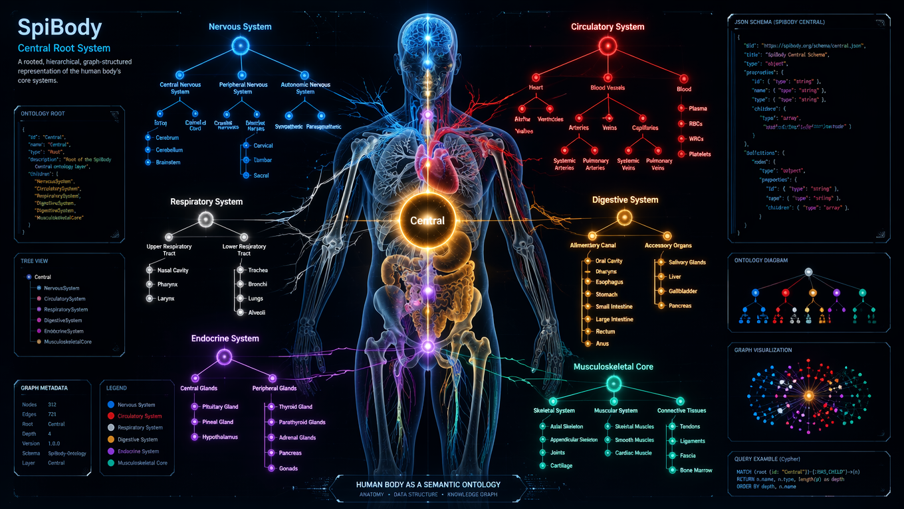
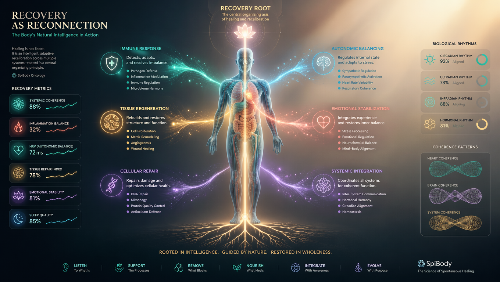
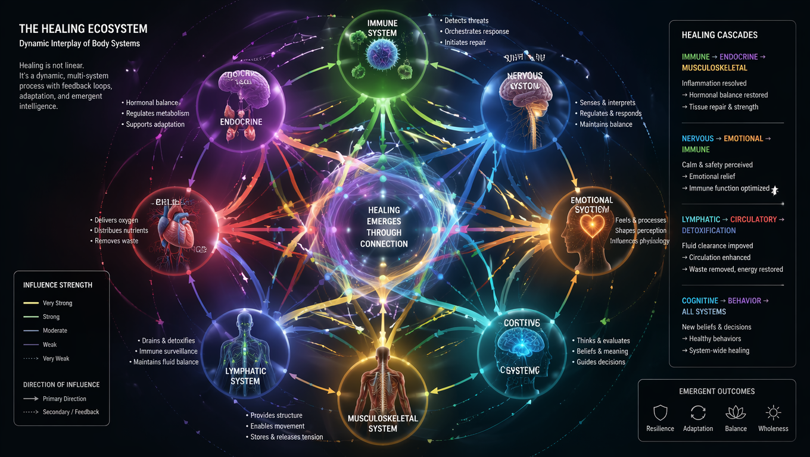
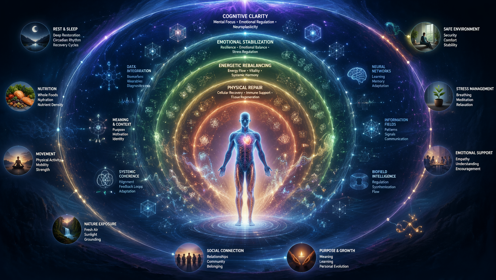
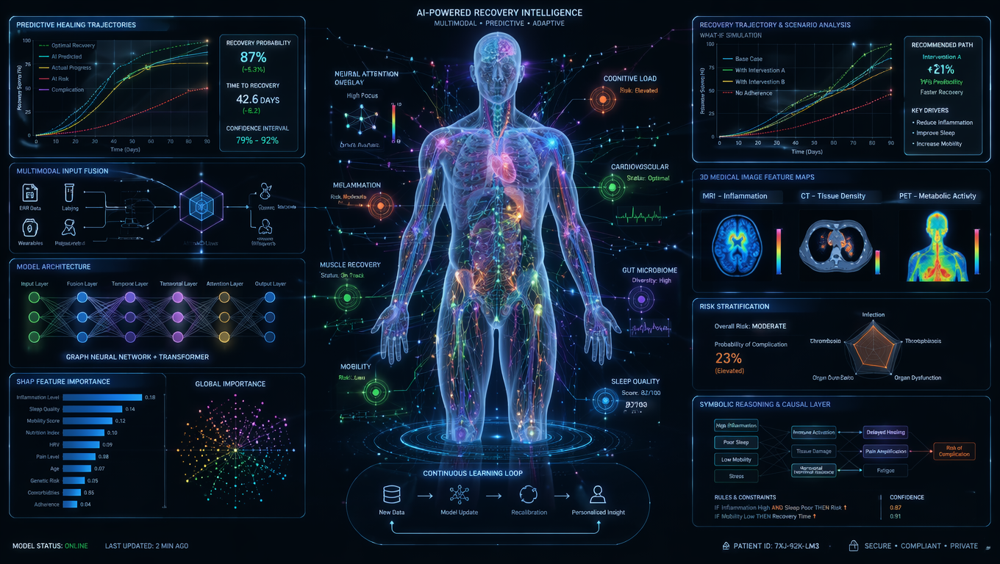

# Let's add some images here.

# 🧬 Image Definition: *SpiBody – Central Root System*



A hyper‑detailed, full‑page illustration depicting the “Central” layer of the SpiBody ontology — a rooted, hierarchical, graph‑structured representation of the human body’s core systems.

The image shows a luminescent, semi‑transparent human figure standing in anatomical position, rendered in a style blending biomedical illustration, knowledge‑graph visualization, and futuristic neural‑network aesthetics.

At the center of the figure is a radiant vertical axis representing the root node of the SpiBody hierarchy. From this axis, branching lines extend outward like a living data structure. Each branch is color‑coded to match the conceptual groupings in the `Central` folder:

- Nervous System — electric blue filaments forming a dense, fractal‑like network around the spine and brain  
- Circulatory System — deep red vascular arcs radiating from the heart node  
- Respiratory System — silver‑white branching structures resembling bronchial trees  
- Digestive System — warm amber pathways flowing downward from the central axis  
- Endocrine System — violet nodes glowing like signal beacons  
- Musculoskeletal Core — geometric, structural lines forming a supportive lattice  

Each subsystem is represented as a cluster of labeled nodes, connected by thin, glowing edges that visually encode the hierarchical relationships defined in the repository.

The root node is shown as a bright, pulsating sphere labeled *Central*, with sub‑roots branching symmetrically into the major body systems.

Around the figure floats a halo of metadata glyphs: JSON‑like brackets, tree diagrams, and small code fragments referencing the structure of the SpiBody dataset. These elements subtly hint at the computational nature of the project without overwhelming the biological imagery.

The background is a dark gradient (deep navy to black), with faint grid lines and soft volumetric light, giving the impression of a scientific interface or a high‑resolution anatomical atlas.

Overall, the image conveys the idea of the human body as a rooted, interconnected, semantically organized system, visually merging anatomy, data structures, and ontology design into a single coherent illustration.

# 📘 SpiBody – Image Specification Archive  
This file stores the **original image generation tasks** for the Holistic Body documents.  
All images below are referenced by both:

- `Rooted/Central/holisticbody.md`
- `Rooted/Central/holisticbodyai.md`

Three images are shared; one is unique per file.

---

## ⭐ IMAGE 1 — Shared (placed at the beginning of both files)

### **Image: Holistic Central Body Root**  
**Filename:** `HolisticCentralRoot.png`  


##### **Long Description**
```
A full‑page, high‑resolution illustration presenting the human body as a unified,
root‑structured, multi‑layered system. The figure stands in anatomical position,
semi‑transparent, illuminated from within by a vertical central axis representing
the “Central Root” of the SpiBody ontology.

Branching from this axis are luminous pathways representing the major integrated
domains: physical anatomy, energetic flow, cognitive processes, emotional fields,
and environmental interaction layers. Each domain is color‑coded and rendered as
a hybrid between biological anatomy and abstract data‑graph structures.

The background is a deep gradient with faint grid lines, evoking a scientific
interface. Around the figure float metadata glyphs, JSON‑like brackets, and
semantic‑graph nodes, symbolizing the computational nature of the SpiBody model.

The entire composition conveys the idea of the human organism as a holistic,
interconnected, multi‑dimensional system rooted in a central organizing principle.
```

**Placement:**  
- `holisticbody.md` → very top  
- `holisticbodyai.md` → very top  

---

## ⭐ IMAGE 2 — Shared (mid‑document)

### **Image: Systemic Interconnection Map**  
**Filename:** `SystemicInterconnection.png`  


##### **Long Description**
```
A wide, horizontally oriented diagram showing the interconnections between the
body’s central systems: nervous, circulatory, respiratory, digestive, endocrine,
musculoskeletal, cognitive, emotional, and environmental.

Each system is represented as a cluster of nodes arranged in a radial pattern
around a central hub. Edges between nodes glow with varying intensity to indicate
relationship strength. The style blends anatomical accuracy with graph‑theory
visualization: organic curves meet geometric node‑link structures.

Subtle labels float near each cluster, and faint overlays show how systems
interact across layers (e.g., emotional → endocrine, cognitive → nervous,
environmental → respiratory).

The image communicates the multi‑directional, dynamic, and emergent nature of
holistic systemic interaction.
```

**Placement:**  
- `holisticbody.md` → after system‑relationship section  
- `holisticbodyai.md` → after AI‑interpreted system‑link section  

---

## ⭐ IMAGE 3 — Shared (near the end of both files)

### **Image: Central Integration Field**  
**Filename:** `CentralIntegrationField.png`  


##### **Long Description**
```
A large, immersive visualization showing the human body surrounded by a field of
interacting layers: physical, energetic, cognitive, emotional, and informational.

The central figure emits concentric waves of light, each representing a different
functional domain. These waves intersect with floating geometric structures that
symbolize data, meaning, and systemic coherence.

The image blends aesthetics from medical imaging, neural networks, and
information‑field diagrams. Soft volumetric lighting creates a sense of depth and
continuity. The outermost layer contains symbolic representations of environment,
culture, and context, showing how the individual is embedded in larger systems.

This image conveys the idea of holistic integration: multiple layers of human
functioning merging into a single coherent field.
```

**Placement:**  
- `holisticbody.md` → second‑to‑last section  
- `holisticbodyai.md` → second‑to‑last section  

---

## ⭐ IMAGE 4A — Unique to holisticbody.md (final image)

### **Image: Human‑Centered Holism Diagram**  
**Filename:** `HumanCenteredHolism.png`  


##### **Long Description**
```
A warm, human‑focused illustration emphasizing lived experience, embodiment, and
subjective perception. The figure is surrounded by soft, flowing shapes that
represent emotional resonance, sensory experience, and personal meaning.

The style is more organic and less technical than the AI‑focused images. Colors
blend smoothly, and the composition evokes a sense of presence, grounding, and
wholeness. Subtle anatomical hints remain, but the emphasis is on the felt sense
of being a unified human organism.

This image supports the human‑centric narrative of holistic embodiment.
```

**Placement:**  
- `holisticbody.md` → final image at the end  

---

## ⭐ IMAGE 4B — Unique to holisticbodyai.md (final image)

### **Image: AI‑Augmented Holistic Model**  
**Filename:** `AIAugmentedHolism.png`  


##### **Long Description**
```
A highly technical, AI‑infused visualization showing the human body overlaid with
machine‑learning structures: attention maps, vector fields, graph embeddings, and
semantic clusters.

The figure is semi‑transparent, with neural‑network‑like filaments weaving through
the body. Around it float holographic panels displaying model outputs, feature
maps, and symbolic reasoning layers.

The aesthetic is futuristic and computational, emphasizing how AI interprets,
models, and augments holistic human understanding. The image bridges biological
reality with algorithmic representation.
```

**Placement:**  
- `holisticbodyai.md` → final image at the end  

---

# ✔ End of Image Specification Archive

# 📘 SpiBody – Image Specification Archive (Health & Recovery)
This file stores the **original image generation tasks** for the Health & Recovery documents.  
All images below are referenced by both:

- `Rooted/Central/healthandrecovery.md`
- `Rooted/Central/healthandrecoveryai.md`

Three images are shared; one is unique per file.

---

## ⭐ IMAGE 1 — Shared (placed at the beginning of both files)

### **Image: Recovery Central Root Field**  
**Filename:** `RecoveryCentralRoot.png`  


##### **Long Description**
```
A full‑page, high‑resolution illustration showing the human body in a state of
healing and systemic recalibration. The figure stands in anatomical position,
semi‑transparent, illuminated by a soft vertical axis representing the “Recovery
Root” of the SpiBody ontology.

From this axis radiate gentle, glowing pathways symbolizing the body’s natural
healing systems: immune response, tissue regeneration, autonomic balancing,
cellular repair, and emotional stabilization. Each pathway is color‑coded with
soothing tones—teal, soft gold, pale violet, and warm coral.

The background is a dark‑to‑light gradient, evoking a transition from illness to
restoration. Floating around the figure are subtle glyphs representing recovery
metrics, biological rhythms, and systemic coherence patterns.

The image conveys the idea that healing is a multi‑layered, interconnected
process rooted in a central organizing principle of recovery.
```

**Placement:**  
- `healthandrecovery.md` → very top  
- `healthandrecoveryai.md` → very top  

---

## ⭐ IMAGE 2 — Shared (mid‑document)

### **Image: Healing System Dynamics Map**  
**Filename:** `HealingDynamicsMap.png`  


##### **Long Description**
```
A horizontally oriented diagram illustrating the dynamic interplay between the
body’s healing systems: immune, endocrine, nervous, circulatory, lymphatic,
musculoskeletal, emotional, and cognitive.

Each system is represented as a node cluster arranged in a circular or radial
pattern. Edges between clusters glow with varying intensity to represent the
strength and direction of healing influence. For example: immune → endocrine,
nervous → emotional, lymphatic → circulatory.

The visual style blends anatomical accuracy with systemic modeling: organic
curves meet geometric node‑link structures. Soft gradients and translucent
overlays show how healing cascades propagate across systems.

The image communicates that recovery is not linear but a dynamic, multi‑system
process with feedback loops and emergent patterns.
```

**Placement:**  
- `healthandrecovery.md` → after the section describing healing phases  
- `healthandrecoveryai.md` → after the section describing AI‑interpreted healing dynamics  

---

## ⭐ IMAGE 3 — Shared (near the end of both files)

### **Image: Integrated Recovery Field**  
**Filename:** `IntegratedRecoveryField.png`  


##### **Long Description**
```
A large, immersive visualization showing the human body surrounded by a layered
field of recovery processes: physical repair, emotional stabilization, cognitive
clarity, energetic rebalancing, and environmental support.

The central figure emits soft concentric waves of light, each representing a
different recovery domain. These waves intersect with floating geometric
structures symbolizing data, meaning, and systemic coherence.

The aesthetic blends medical imaging, neural‑network visualization, and
information‑field diagrams. Soft volumetric lighting creates a sense of depth and
continuity. The outermost layer contains symbolic representations of supportive
environmental factors such as rest, nutrition, and social connection.

This image conveys the idea of integrated recovery: multiple layers of healing
merging into a coherent, unified process.
```

**Placement:**  
- `healthandrecovery.md` → second‑to‑last section  
- `healthandrecoveryai.md` → second‑to‑last section  

---

## ⭐ IMAGE 4A — Unique to healthandrecovery.md (final image)

### **Image: Human‑Centered Healing Pathway**  
**Filename:** `HumanHealingPathway.png`  


##### **Long Description**
```
A warm, human‑focused illustration emphasizing the lived experience of healing.
The figure is surrounded by soft, flowing shapes representing emotional release,
rest, comfort, and personal resilience.

The style is organic and gentle, with smooth color transitions and a sense of
inner calm. Subtle anatomical hints remain, but the emphasis is on the subjective
experience of recovery: breath, rest, grounding, and reconnection with the body.

This image supports the human‑centric narrative of healing as a personal,
embodied journey.
```

**Placement:**  
- `healthandrecovery.md` → final image at the end  

---

## ⭐ IMAGE 4B — Unique to healthandrecoveryai.md (final image)

### **Image: AI‑Enhanced Recovery Model**  
**Filename:** `AIEnhancedRecovery.png`  


##### **Long Description**
```
A highly technical, AI‑infused visualization showing the human body overlaid with
machine‑learning structures that model recovery: predictive healing curves,
feature maps, attention overlays, and systemic risk indicators.

The figure is semi‑transparent, with neural‑network‑like filaments weaving through
the body. Around it float holographic panels displaying model outputs, recovery
trajectories, and symbolic reasoning layers.

The aesthetic is futuristic and computational, emphasizing how AI interprets,
predicts, and augments human recovery processes. The image bridges biological
healing with algorithmic insight.
```

**Placement:**  
- `healthandrecoveryai.md` → final image at the end  

---

# ✔ End of Image Specification Archive (Health & Recovery)
