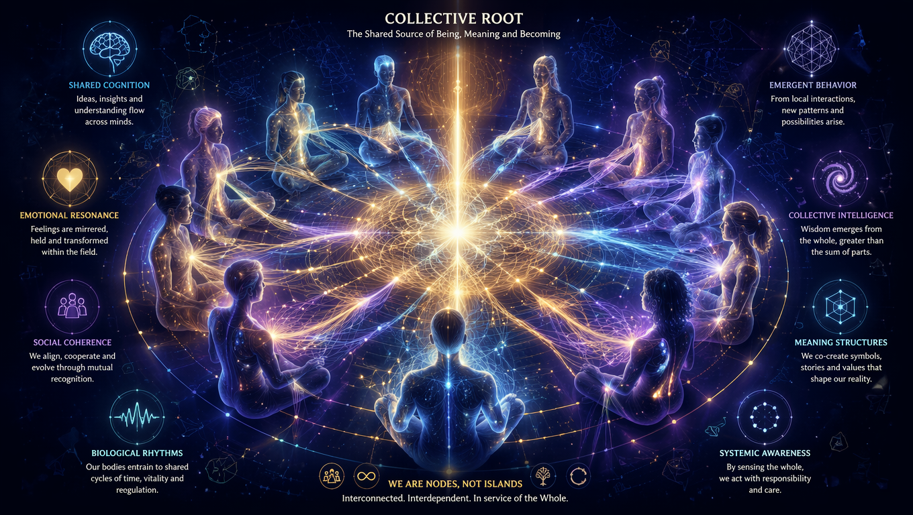
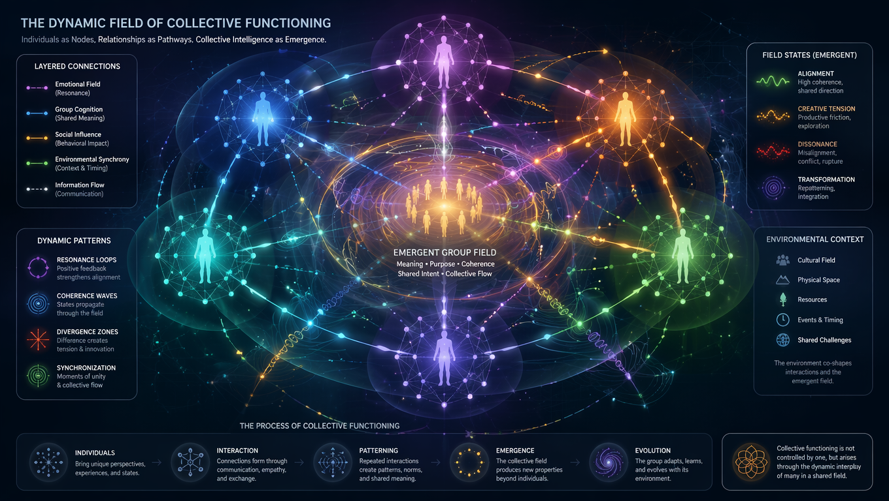
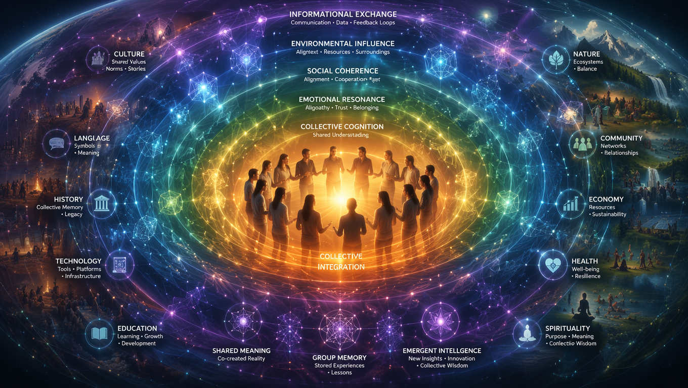
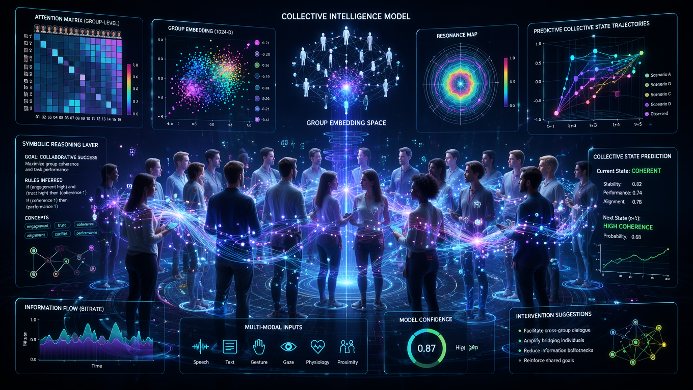

# 🤝 Training a Collective: Muscles of Society

One body must be holistic — but so must the *collective body*. 🧬 When time is limited for individuals, we can still build a resilient society by sharing responsibility for *physical training*.

Even for spiritual people, physical movement is essential. Icons like **Bruce Lee** have shown: spirit and strength are teammates.

---

## 🧫 Creating a Cellular Structure

To train a collective, we need a structure. Consider:

- Mapping daily tasks, workplaces, and common duties
- Evaluating which **muscular strengths** are most needed
- Identifying underdeveloped and overrepresented abilities

This creates a **strength map** for society, usable in two key ways:

### 🎲 1. Dice Method – The Algorithm of Need

Using societal percentages as probabilities, a randomized system (like dice rolls or base-6 logic) can assign individuals a **5-year training plan** tailored to public needs. 

Each plan covers both *mental* and *physical* aspects. It's fair, flexible, and adaptive. The sum of all personal paths creates a pie chart of society’s holistic development.

### 🏋️‍♀️ 2. Teams & Clubs – Shared Strength

Groups can divide and conquer — forming **teams with complementary skills**. They train together, build motivation, and shape each other through contact and cooperation.

Trainers, feedback loops, and dynamic structures help turn fitness into **collective evolution**.

---

## 🧠✨ The Magic of Contact

Contact isn’t just physical — it's **mental, emotional, and spiritual**. Games, group workouts, and conversation are all training tools.

🎼 **Think orchestra**: Each muscle group like an instrument.  
🎤 **Or choir**: Coordinated voices, synchronized breath.  
🏀 **Or sport**: Dynamic, reactive, social strength.

This leads to a **gym of society** — not endless reps, but a structure of *possibilities*, mirroring the society we envision.

> 🧘‍♂️ *Mental exercise is incomplete without the physical. Meditation must meet motion.*

---

## ✋ Fractal Strength: Small to All

Training one part strengthens the whole. Example:

- Training **palms** in all body positions activates:
  - Small muscles
  - Joint intelligence
  - Whole-body vitamin systems

Weak hands limit big muscle growth. Strong hands unlock the body.

Each movement sends tension through the body — like pushing a wall with one hand. That force echoes throughout your structure. This is **taoist muscle logic**. 🌀

Every joint, every layer, every axis contributes to a **fractal body intelligence** — one that mirrors the *social body*. Muscles of society. Teams of tension. Collaboration through motion.

> 🧠 The brain of the hand = the worker’s intelligence. Society = a set of interlocked movements forming one divine choreography.

---

## 🧩 Paradigm Structure

Compare this model to:

- Existing team sports
- Workplace mechanics
- Psychological and spiritual practices

🌐 We are all part of one **collective organism**. As individuals come and go, the system must still function. Holistic gyms, sports clubs, and work routines can align with this vision — often already do.

> We don’t need to reinvent the wheel. We just need to rotate it *together*.

---

## 🏃‍♂️ Muscles or Skills?

Muscles grow from **repetition**, but skills grow from **variation**.

At first, repetition strengthens a single part. But eventually:

- Muscles **branch into joints**
- Movements **become skills**
- Systems **get tired at multiple levels**

### 🧠 Energy Types

- Some actions drain *instantly*
- Others last *minutes*
- Some fatigue *days* later

Each kind requires a different recovery cycle. And *excuses* often trace back to energy limits we haven’t mapped.

Recovery isn't just sleep. It's variation. **Vacation. Routines. Play. Purpose.** 🔁

Even *missing* an exercise, or *imagining* it, trains the system. Life’s complexity feeds training intelligence.

---

## 🎮 Play Is Practice

Our natural love for play, fun, games, even watching sports — it's not wasted energy. It's a **coded survival tool**. And training that aligns with pleasure is sustainable.

> We don’t just want to train.  
> We want to *live* training — together.

---

**🏁 Collective Training = Shared Strength × Purpose × Play.**  

Let every move count. Let every person matter.  
Build a society that flexes *together*. 💪🌍

