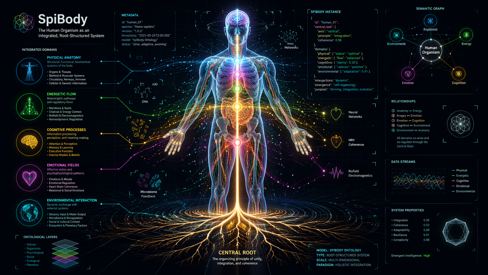
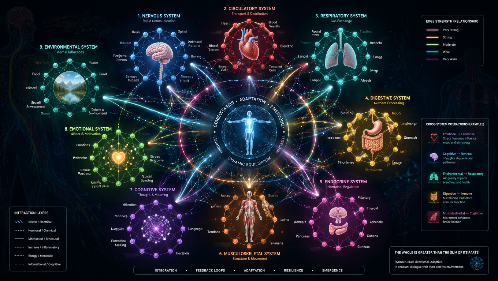
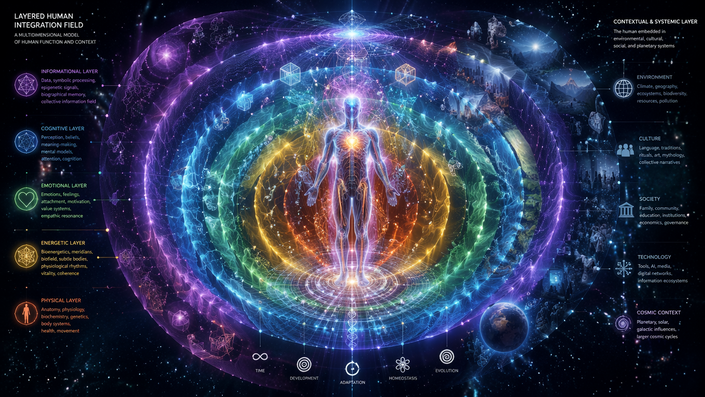

 

_This version is written by AI based on [holisticbody.md](holisticbody.md)_

# 🧘 Training the Body Through a Spiritual Lens

In a world increasingly focused on quantifiable results, training the body from a spiritual perspective offers a profound counterbalance. This path is not about achieving peak performance in measurable ways, but about attuning oneself to deeper layers of wisdom, intuition, and presence.

Though not formally trained in yoga, I study martial arts philosophies and diverse body cultures to explore the unseen wisdom embedded in movement. This approach aligns well with modern spirituality—seeking essential truths through experience and insight, not through rigid authority.

## 🌿 A Holistic View of Physical Development

Holistic training doesn’t isolate muscles or functions—it embraces the body’s full complexity. Influencers like Bruce Lee understood this: he emphasized **speed, flexibility, and strength** as interconnected properties of bodily mastery.

Rather than relying on sheer force, holistic practice emphasizes subtle improvements:
- 🌱 Increasing flexibility by millimeters
- 🧩 Strengthening overlooked areas
- 🌀 Enhancing coordination among muscle groups

Even small gains can yield a profound increase in efficiency and bodily harmony.

## 🔁 Fractals of Movement: The Body as a Pattern

The body is fractal in nature—parts within parts, movements within movements. For example:
- A hand’s motion involves the fingers, wrist, forearm, even shoulder and back.
- Training one area deeply echoes through the entire body, fostering holistic integration.

Understanding this layered system allows for a more complete approach to cultivation—not just training isolated muscle groups, but activating the body's innate connectivity.

## 🪷 Contemplating the Body in Meditation

Zen, Buddhist meditation, and other contemplative practices offer tools for sensing and refining our inner world. When applied to the body:
- 🧠 We become aware of both internal and external organs.
- ⚡ We learn to recruit different types of muscles: slow, fast-twitch, even those engaged through electromagnetic or circulatory effects.
- 🫀 We enhance awareness of organs and their growth through focused attention and movement.

The body becomes not just a vessel, but a source of insight and transformation.

## 💓 Training Organs, Joints, and Chakras

While physical training often focuses on visible muscles, contemplative methods also include:
- 🧠 The head and brain
- ❤️ The heart and other organs
- 🍑 Hips, genitals, joints, and even the spine

Practicing movement and awareness in these regions strengthens energetic centers (chakras), expanding capabilities in unexpected ways.

## 🛑 Avoiding Overtraining: Intuitive Resistance

Effective physical work isn’t about brute repetition. It’s about intelligent resistance:
- 🤲 Explore movements that are **naturally difficult**
- 🧠 Rediscover familiar gestures in **new positions**
- 🧘 Embrace inner tension rather than forceful exertion

Intuition becomes a guide for sustainable, transformational practice.

## 🧬 Layers of Intelligence Within the Body

The body is layered:
- Muscle systems link multiple regions together
- Training lower-energy areas can evolve them into reservoirs of strength, vitamins, and coordination
- Sensitivity builds intelligence across the body, creating internal resources that go beyond nutrition or biology

Movement, then, becomes a path toward embodied wisdom.

## ✨ Signs and Symbolism: The Magic of Training

As practice deepens, subtle “signals” begin to surface:
- Muscles may shift character or "reveal" symbolic qualities
- Visual effects and sensations emerge with new capabilities
- Intuition becomes a compass for unexplored territory

Spiritual training invites these mysteries to unfold—through discipline, awareness, and personal evolution.

 

