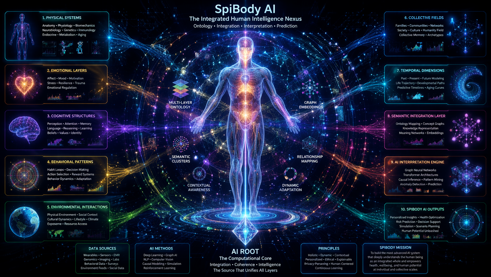
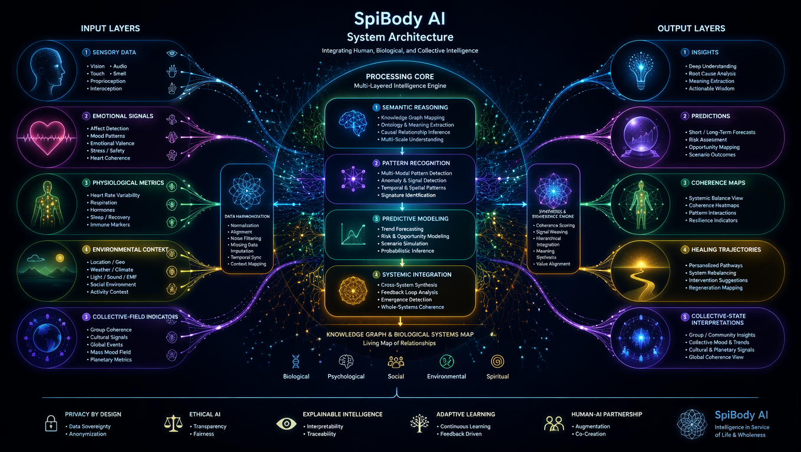
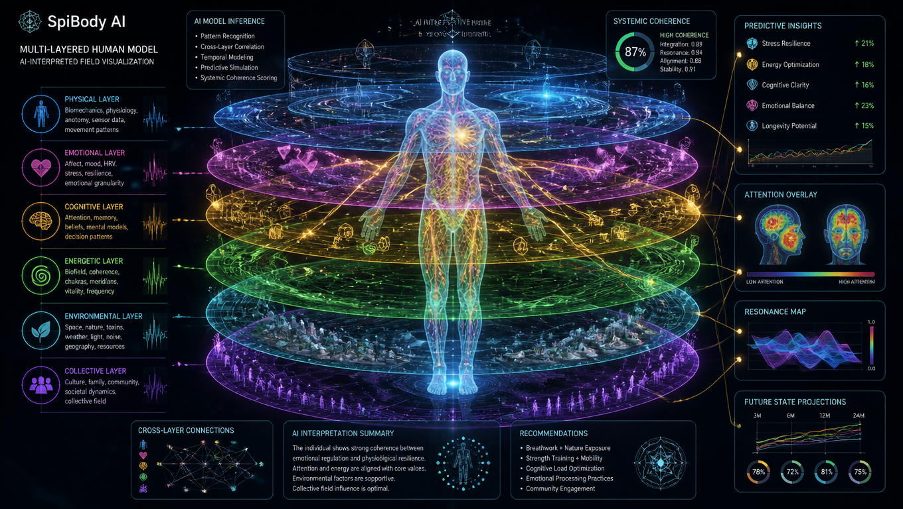
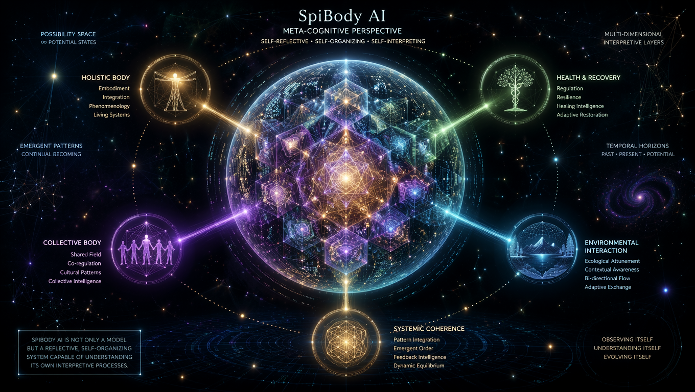

# 🌱 SpiBody Unified Theory  
### *Holistic Body • Recovery • Laegna • SpiZenTao • Fractal Soma*

This document unites the core principles from **SpiBody**, **SpiZenTao**, **Laegna**, and related writings into one coherent theory and practice. It is structured according to **Laegna clarity standards**:  
- **Rooted** (physical)  
- **Central** (mind–body integration)  
- **Crown** (spiritual & systemic)  

The goal is a **complete, fractal, embodied philosophy** of training, healing, and living.

Original version: [Part 1](healthandrecovery.md), [Part 2](holisticbody.md) and [Part 3](collectiveholisticbody.md).

---

# 1. 🌍 Foundations: The Holistic Body

## 1.1 The Body as a Fractal System
The body is not a collection of isolated muscles or organs — it is a **fractal organism**.  
Every part contains micro‑versions of the whole:

- A finger contains micro‑movements of the arm.  
- The spine contains micro‑patterns of the whole body.  
- A tooth reflects systemic tension patterns.  
- A single breath reflects the entire nervous system.

This is the **SpiBody Principle**:  
> *Train one part → influence the whole.*

This is also a **Laegna principle**: systems are recursive, self‑similar, and self‑improving.

## 1.2 Holistic Training
Traditional training isolates: “legs day”, “arms day”, “core day”.  
SpiBody trains **properties**, not parts:

- **Speed**
- **Flexibility**
- **Strength**
- **Micro‑control**
- **Internal sensation**
- **Organ awareness**
- **Structural intelligence**

This mirrors Bruce Lee’s philosophy, but extends it into **internal organs, fascia, and subtle systems**.

## 1.3 The Body as a Spiritual Instrument
SpiZenTao teaches that the body is a **gateway to intuition**.  
Training is not only physical — it is:

- contemplative  
- sensory  
- philosophical  
- structural  
- energetic  

Meditation is not separate from movement.  
Movement is meditation.

---

# 2. 🧘  Contemplation & Internal Awareness

## 2.1 Meditation on Body Parts
Zen‑style contemplation is applied to:

- muscles  
- joints  
- organs  
- nerves  
- fascia  
- breath  

This creates **direct sensation**, which is the prerequisite for:

- micro‑movement  
- organ training  
- pain transformation  
- structural intelligence  

## 2.2 Internal Muscles & Organ Training
You can train:

- heart sensation  
- lung expansion  
- digestive organs  
- pelvic floor  
- cranial muscles  
- “electric” or fast‑response fibers  

Organs respond to:

- pressure  
- breath  
- micro‑tension  
- visualization  
- structural alignment  

This is not mystical — it is **somatic neuroplasticity**.

---

# 3. 🧩 Layers, Properties & Structural Intelligence

## 3.1 Layers of the Body
SpiBody identifies layers:

- **Surface muscles**  
- **Deep muscles**  
- **Joints**  
- **Organs**  
- **Nervous system**  
- **Energy-like sensations** (Laegna: *subtle layers*)  

Training must move through all layers.

## 3.2 Structural Intelligence
The body contains **multi‑part muscles** that connect distant regions:

- training the pelvis improves walking  
- training the jaw affects the spine  
- training the hands influences the heart  
- training the feet influences the head  

This is the **fractal soma**.

---

# 4. 🔥 The Magic of Training (SpiBody Phenomenology)

The body communicates through:

- sensations  
- micro‑signals  
- visual effects  
- “idiot muscles” (undeveloped fibers)  
- sudden breakthroughs  

These are not supernatural — they are **neuro‑muscular feedback loops**.

Training becomes a dialogue:

> *The body shows → you respond → the body adapts.*

---

# 5. 🛠️ Practical Training Principles

## 5.1 Avoid Overexertion
Instead of brute force:

- find naturally difficult positions  
- train micro‑movements  
- use slow tension  
- explore unusual angles  
- train fingers in every hand position  
- train joints, not only muscles  

This builds **complete capability**, not isolated strength.

## 5.2 The Millimeter Philosophy
A millimeter of improvement in:

- flexibility  
- joint rotation  
- organ sensation  
- breath depth  

…multiplies across the fractal system.

---

# 6. 🩺 Recovery as Training (Unified with *healthandrecoveryai.md*)

Recovery is not passive.  
It is **active transformation**.

Below are the five major case studies from your text, rewritten into unified theory.

---

## 6.1 The Spine Story — *Pain as Dormant Potential*
A childhood injury created 30 years of back pain.  
At age 43, a single correct movement activated dormant fibers.

**Principle:**  
> Pain is often *untrained muscle*, not damage.

**Practice:**  
- explore slow spinal waves  
- train deep back muscles  
- use breath to expand vertebrae  
- avoid fear‑based immobility  

---

## 6.2 Winter Ears — *Muscle as Armor*
Chronic cold‑sensitive ear pain disappeared after training:

- neck  
- scalp  
- hands  

**Principle:**  
> Pain is sometimes lack of structure, not organ weakness.

**Practice:**  
- build muscular “hoods” around vulnerable areas  
- train head–neck integration  
- use cold exposure as feedback  

---

## 6.3 Mind Over Migraine — *The Head–Body Bridge*
Migraines reduced through:

- cranial muscle training  
- oxygenation  
- V‑shaped head–body alignment  

**Principle:**  
> Thinking becomes physical when the head is structurally supported.

**Practice:**  
- train jaw, tongue, scalp  
- align spine → skull → breath  
- use micro‑tension to clear head fog  

---

## 6.4 Legs of Patience — *Pain as Slow‑Growing Muscle*
Cold‑sensitive leg pain transformed through:

- tension  
- meditation  
- staying with the sensation  

**Principle:**  
> Long-term pain can be a muscle waiting to awaken.

**Practice:**  
- hold positions  
- breathe into discomfort  
- allow transformation  

---

## 6.5 The Tooth Paradox — *Fractal Regeneration*
Instead of implants, you trained:

- hands  
- fingers  
- neural maps  
- “vitamin organs”  

Pain decreased in dominance.

**Principle:**  
> Teeth are part of a systemic web.

**Practice:**  
- train jaw–hand connection  
- build systemic strength  
- treat pain as communication  

---

# 7. 🌀 Laegna Integration

Laegna requires:

- **clarity**  
- **layered ontology**  
- **system–subsystem coherence**  
- **fractal mapping**  
- **practical pathways**  

This document follows these standards:

- Rooted → physical training  
- Central → mind–body integration  
- Crown → systemic & spiritual meaning  

SpiBody becomes a **Laegna‑compliant somatic system**.

---

# 8. 🛤️ SpiZenTao Integration

SpiZenTao contributes:

- intuitive wisdom  
- non‑authoritarian spirituality  
- Zen contemplation  
- Taoist naturalness  
- martial arts philosophy  

Training becomes:

- simple  
- direct  
- experiential  
- non‑dogmatic  

---

# 9. 🧭 Unified Practice Routine (Daily)

### Morning — *Rooted*
- joint rotations  
- spine waves  
- breath expansion  
- finger micro‑training  

### Midday — *Central*
- organ meditation  
- cranial muscle activation  
- slow tension holds  

### Evening — *Crown*
- contemplative sitting  
- whole‑body awareness  
- structural scanning  

---

# 10. 🌟 Final Principle: The Body Is a Long Game

> **Pain → Focus → Movement → Muscle → Power**

Recovery is rhythm.  
Training is conversation.  
The body is a fractal universe.  
You are its explorer.

