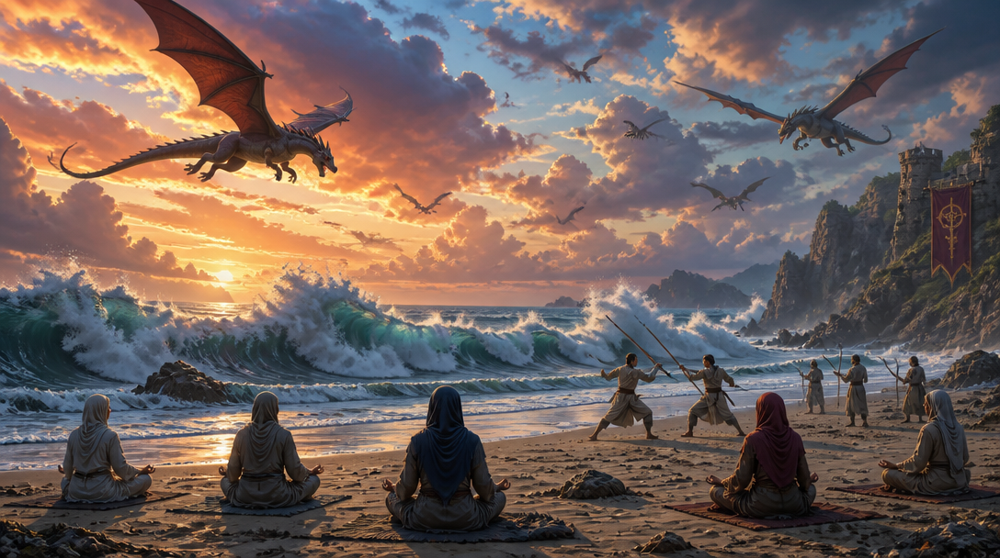

# 11 august 2026

I have made sure the principles are here all around:
- Principles I have found in old traditions, which are *essential, deep and simple*.
  - It's aligned with deep fundamentals, while respecting that you can learn each tradition to understand the excess amount of work on each such principle.
- I optimized those goals with math.
  - Old traditions did show that long term goal might valuate E over A, which are many famous examples.
  - I tried to create math: E and A can be or are entered, and balanced.
- We know that basic physical training essentials are very common to humans, even animals:
  - I could have instantly the basic parameters, so concrete stories and examples are made - this is not abstract math or science.
  - While my optimizations are given, on other page the *opposite goal* is also given to show I understand long term goals, but also that short term doings save the day.

## My own training

My own training is kept on line:
- I continue all practices.
  - Because complex things become simpler, I keep the calculation of simplicity but the actual exercise in actuality, is subjectively the same - non-complex, and I won't get tired -, but indeed it's already more complex in previous terms.
  - I definitely have joints, my hips look nice and whole body is in balanced, stable strength.
  - Old pains: legs have one muscle of tissue, which I did not use much and which was pained if I stretched to that point and kept so; Taoist says legs are where we start dying, but in my legs this tissue or muscle is slowly replacing the dead, definite pain with decent, strong pains of growth and muscular activity.
- My movement
  - Sometimes really free.
  - Small things have more angles, I go over boundaries with no effort:
    - They look smooth, effortless, eventually surprising.
- The feelings of growth
  - I wanted to avoid aggressive muscle which just creates feelings of stable rage always written in face and body as is grows;
    - Even if some rage might be necessary if the experience has given such growth.
  - Rather, the "lifeness" and "humanness":
    - I eventually, in my body, grasp glimpsed of "reality", "humanity"; things take forms they were given.

I am sure:
- Things this society does not live;
  - Are to important degree things they have no muscles, nerves, bones and brains for.
