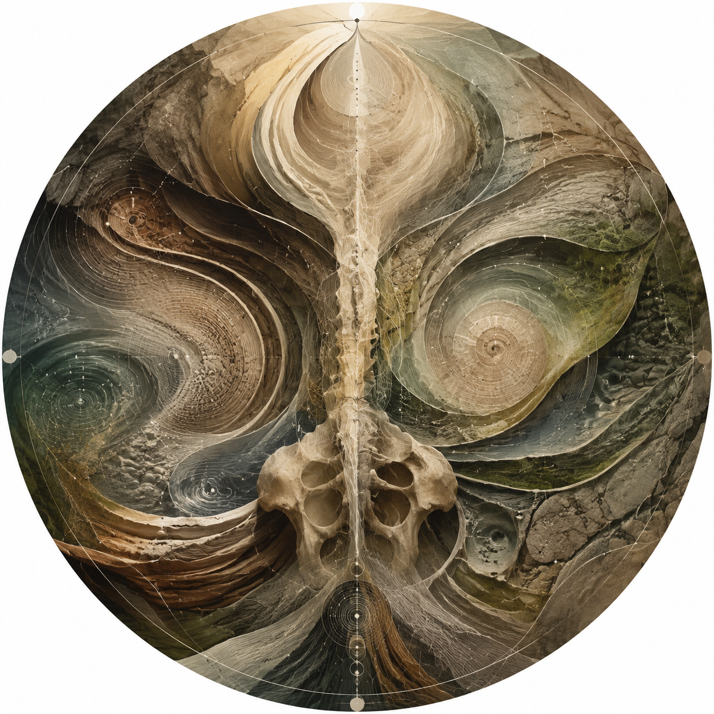
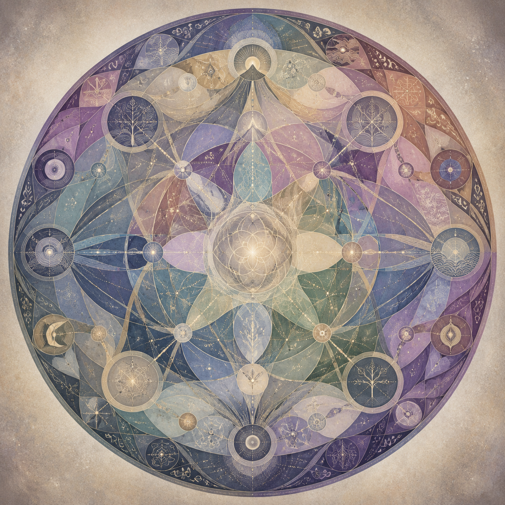
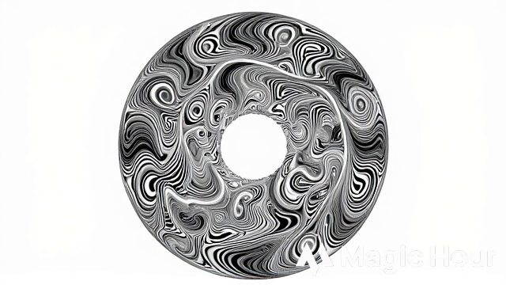
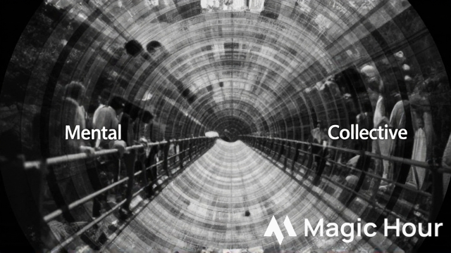
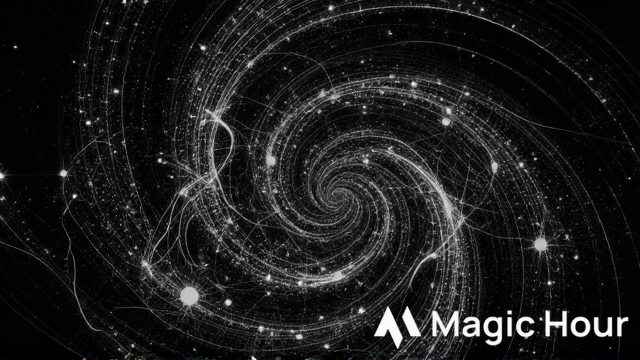

# 🖼️ SpiBody Notes — Images1 Set  
Illustrations for the Notes Overview

This folder contains seven images designed to accompany the Notes overview page.  
Three images correspond to the **Physical**, **Mental**, and **Collective** domains,  
while four additional images enrich the transitions and structural logic of the Notes system.  

Each image is circular and symbolic.  
Individually they appear abstract or surreal, but when viewed together they resemble  
the three domain‑icons and their four connective principles.

---

# Image A0 — “Physical Domain — Embodied Ground”  
**Filename: A0_PhysicalDomain**



```

```

**Long Prompt:**  
```
A circular, surrealistic composition representing the Physical Domain of SpiBody Notes.
The image should evoke groundedness, weight, and the subtle architecture of the living
body. Think of the body not as anatomy but as a field of forces: tension lines, spirals
of pressure, soft gradients of weight transfer, and the quiet intelligence of bones.
The circle may contain layered textures resembling fascia, stone, or slow‑moving water,
suggesting stability without rigidity. Hints of green or earth‑tones may appear, but
only as atmospheric undertones. The overall effect should feel like a living
architecture seen from within — a symbolic cross‑section of embodied presence. When
placed next to the other domain images, it should subtly echo their geometry without
becoming an icon by itself.
```

---

# Image A1 — “Mental Domain — Inner Sky”  
**Filename: A1_MentalDomain**


```

```

**Long Prompt:**  
```
A circular, airy, surrealistic image representing the Mental Domain. The composition
should feel spacious, luminous, and open — like a sky seen from inside the mind. Use
soft gradients, floating shapes, or translucent layers that evoke attention shifting,
thoughts forming, and awareness expanding. The image should not depict a brain or
literal cognition; instead, it should express the movement of attention: focus
narrowing, widening, dissolving, and reforming. Hints of blue or cool tones may appear
as atmospheric suggestions. The circle should feel like a window into an inner
atmosphere, a mental horizon where clarity and ambiguity coexist. When placed with the
other domain images, it should resonate as the middle layer between body and world.
```

---

# Image A2 — “Collective Domain — Shared Field”  
**Filename: A2_CollectiveDomain**



```

```

**Long Prompt:**  
```
A circular, patterned, surrealistic image representing the Collective Domain. The
composition should evoke connection, shared meaning, and relational dynamics without
depicting people or social scenes. Think of overlapping fields, interwoven threads, or
repeating motifs that suggest communication, ritual, and cultural resonance. The image
should feel communal but abstract — a symbolic representation of how individual
experiences interlock to form collective structures. Hints of purple or warm‑cool
blends may appear, but the palette should remain subtle. The circle should feel like a
shared field of intention, a symbolic membrane where many lives meet. When placed with
the other domain images, it should complete the triad as the outward‑facing layer.
```

---

# Image A3 — “Threefold Arc — Body, Mind, World”  
**Filename: A3_ThreefoldArc**



```

```

**Long Prompt:**  
```
A circular image unifying the three domains into a single symbolic arc. The composition
should contain three interacting currents, rings, or flows — not as literal icons, but
as three energies influencing one another. The image should feel like a dynamic
mandala: the grounded density of the Physical Domain, the airy spaciousness of the
Mental Domain, and the patterned connectivity of the Collective Domain. These should
blend subtly, with no hard boundaries. The surrealistic style should make the image
feel like a living system rather than a diagram. Placed at the beginning of the Notes,
it should give the sense that the entire folder is a journey through these three
layers.
```

---

# Image A4 — “Inner Mechanics — The Subtle Engine”  
**Filename: A4_InnerMechanics**


```

```

**Long Prompt:**  
```
A circular, layered, mechanical‑organic image representing the hidden mechanics that
run through all three domains. The composition should feel like a subtle engine:
interlocking flows, tension loops, gradients of pressure, and internal rhythms that
shape both body and mind. It should not resemble a machine; instead, it should evoke
the feeling of internal processes — breath cycles, emotional currents, proprioceptive
shifts, and the micro‑movements of attention. The surrealistic style should make the
image feel alive, as if the viewer is seeing the inner workings of experience itself.
Placed between Physical and Mental sections, it should feel like the hinge between
embodiment and awareness.
```

---

# Image A5 — “Inner–Outer Bridge — The Human Continuum”  
**Filename: A5_InnerOuterBridge**



```

```

**Long Prompt:**  
```
A circular, gradient‑layered image representing the bridge between inner experience and
outer behavior. The composition should feel like a membrane or threshold — a place
where internal states become visible in action, and where social interactions reshape
the inner world. Use soft transitions, overlapping layers, or mirrored textures to
suggest permeability and exchange. The surrealistic style should make the image feel
like a living interface rather than a boundary. Placed between Mental and Collective
sections, it should visually express the continuity between thought, emotion,
relationship, and culture.
```

---

# Image A6 — “Cosmic Thread — The Larger Pattern”  
**Filename: A6_CosmicThread**



```

```

**Long Prompt:**  
```
A circular, cosmic, symbolic image representing the cosmological dimension of the
Notes: Tao, reincarnation, eternity, and the living universe. The composition should
feel expansive yet subtle — stars dissolving into patterns, spirals emerging from
darkness, or threads of light weaving through space. It should not be literal
astronomy; instead, it should evoke the sense of a larger pattern that holds the body,
mind, and collective within it. The surrealistic style should make the image feel
timeless, as if it belongs to a symbolic cosmology rather than physical space. Placed
at the end of the Notes, it should open the arc outward into the infinite.
```

---

# End of Images1 README

# 🖼️ SpiBody Notes — Images1 Set  
Illustrations for the Notes Overview

This folder contains seven images designed to accompany the Notes overview page.  
Three images correspond to the **Physical**, **Mental**, and **Collective** domains,  
while four additional images enrich the transitions and structural logic of the Notes system.  

Each image is circular and symbolic.  
Individually they appear abstract or surreal, but when viewed together they resemble  
the three domain‑icons and their four connective principles.

---

# Image A0 — “Physical Domain — Embodied Ground”
Filename: A0_PhysicalDomain

**A0_PhysicalDomain.png**


```

```

```
This image represents the Physical Domain: structure, mechanics, breath, and the
felt sense of embodiment. It should evoke groundedness, weight, and subtle force
distribution. The circular form hints at a living architecture rather than a
mechanical body. Structurally, it anchors the beginning of the Notes journey.
```

**Placement:**  
Place after the header **🟢 Physical Domain**.

---

# Image A1 — “Mental Domain — Inner Sky”
Filename: A1_MentalDomain

**A1_MentalDomain.png**


```

```

```
This image symbolizes the Mental Domain: attention, awareness, intuition, and the
inner landscape of thought. It should feel spacious, airy, and subtly luminous.
The circular form suggests a sky‑like field where positions of mind shift and
reorganize. Structurally, it marks the transition from body to mind.
```

**Placement:**  
Place after the header **🔵 Mental Domain**.

---

# Image A2 — “Collective Domain — Shared Field”
Filename: A2_CollectiveDomain

**A2_CollectiveDomain.png**


```

```

```
This image represents the Collective Domain: relationships, rituals, culture, and
shared meaning. It should feel connective, patterned, and subtly communal. The
circular form hints at overlapping fields and interwoven intentions. Structurally,
it completes the three‑domain arc of the Notes.
```

**Placement:**  
Place after the header **🟣 Collective Domain**.

---

# Image A3 — “Threefold Arc — Body, Mind, World”
Filename: A3_ThreefoldArc

**A3_ThreefoldArc.png**


```

```

```
This image unifies the three domains into a single arc. It should feel like three
interacting circles or currents, each distinct yet mutually shaping. The surreal
composition hints at the continuity between embodiment, attention, and collective
life. Structurally, it introduces the Notes as a coherent system.
```

**Placement:**  
Place after the introductory paragraph of the Notes overview.

---

# Image A4 — “Inner Mechanics — The Subtle Engine”
Filename: A4_InnerMechanics

**A4_InnerMechanics.png**


```

```

```
This image symbolizes the hidden mechanics that run through all three domains:
tension patterns, attention loops, emotional currents, and social feedback. It
should feel like a circular engine or mandala with moving layers. Structurally,
it bridges the Physical and Mental sections.
```

**Placement:**  
Place between **Training & Practice** and **Attention & Awareness**.

---

# Image A5 — “Inner–Outer Bridge — The Human Continuum”
Filename: A5_InnerOuterBridge

**A5_InnerOuterBridge.png**


```

```

```
This image represents the bridge between inner experience and outer behavior.
It should feel like a circular gradient or layered membrane, showing how inner
states shape relationships and how relationships reshape the inner world.
Structurally, it transitions from the Mental to the Collective Domain.
```

**Placement:**  
Place between **Identity, Emotion & Inner Dynamics** and **Social & Relational Dynamics**.

---

# Image A6 — “Cosmic Thread — The Larger Pattern”
Filename: A6_CosmicThread

**A6_CosmicThread.png**


```

```

```
This image symbolizes the cosmological dimension of the Notes: Tao, reincarnation,
eternity, and the symbolic universe. It should feel expansive, star‑like, or
cosmic, yet still circular and subtle. Structurally, it closes the Notes arc by
opening it into a larger pattern.
```

**Placement:**  
Place after the **Cosmology & Spiritual Frameworks** section.

---

# End of Images1 README
