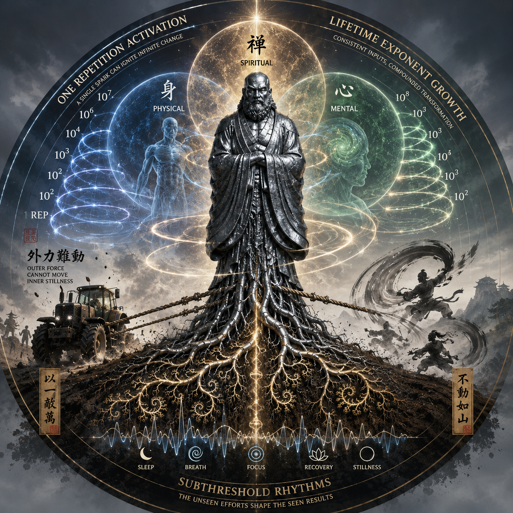

This folder contains a single image:

# Unified Image Description — “Exponent & Ritual: The Standing Mind”

A circular surrealistic mandala unifying the logic of *Exponential Training* with the symbolic ritual of Bodhidharma’s immovable stance. At the center stands a stylized steel Bodhidharma statue, rooted into soft earth by branching metal roots shaped like fractal exponent curves. Around it rise translucent spirals representing one‑repetition activation, lifetime‑scale exponent growth, and subthreshold rhythms of training. A tractor silhouette pulls two fraying ropes, symbolizing worldly authority failing to move inner stillness. Three halos—physical, mental, spiritual—overlap behind the statue, while faint wuxia‑like motion arcs evoke effortless power. A vertical root‑to‑crown axis completes the mandala.

# 100‑Word Image Description — “Rooted Exponent”

A circular image showing a steel Bodhidharma statue fused into the earth by branching metal roots shaped like exponent curves. Soft spirals rise around him, symbolizing one‑repetition activation, fractal training, and the slow buildup of inner power. A tractor silhouette strains against two ropes that fray into karmic threads, representing worldly force failing to move spiritual stability. Behind the statue, three blended halos—body, mind, spirit—form an atmospheric triad. Subtle wuxia‑style motion arcs hover above, hinting at effortless mastery. The whole composition feels like a mandala of grounding, growth, resistance, and transcendence.
